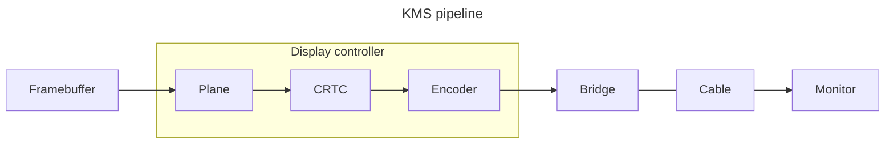

# Display

#### Direct Rendering Manager

The [Direct Rendering Manager (DRM)](https://en.wikipedia.org/wiki/Direct_Rendering_Manager) is a [subsystem of the Linux kernel](https://www.kernel.org/doc/html/latest/gpu/introduction.html) responsible for interfacing with video card GPUs.
DRM is the more modern of the Linux userspace APIs for display, the other being [**fbdev**](#fbdev).
{ .annotate }

DRM exposes GPUs through the filesystem as device files under **/dev/dri** named **card0** etc.

Closely related is **Kernel Mode Setting**, a subcomponent of DRM used to initialize graphics hardware at boot and to change display configuration and mode dynamically (modesetting).
When DRM was first introduced, modesetting was in userspace and closely coupled with X11.
KMS was introduced later and moved modesetting back into kernelspace.
The entire stack is often referred to as DRM/KMS.



- **Framebuffer**: memory buffer with pixel data
- **Plane**: pixel mixing (rotation, scaling, format, etc) layers
- **CRTC** (cathode ray-tube controller): generates timings and pixel streaming
- **Encoder** translates pixel stream to a physical encapsulation (i.e. TMDS for HDMI)
- **Bridge** makes possible transcoding to attach further devices of different types (i.e. DisplayPort)

Display devices are exposed under **/sys/class/drm/card\***

<div class="grid cards" markdown>


-   #### Display server

    ---

    [**Wayland**](https://wayland.freedesktop.org/) is a [display server protocol](https://wiki.archlinux.org/title/wayland) and intended to become the successor for the [X Window System](https://wiki.archlinux.org/title/X_Window_System).
    It has been made the default display server protocol in GNOME, but KDE still uses X11 by default.


-   #### fbdev

    ---

    The [**Linux framebuffer (fbdev)**](https://en.wikipedia.org/wiki/Linux_framebuffer) is a [legacy Linux subsystem](https://www.kernel.org/doc/Documentation/fb/framebuffer.txt) to show graphics on a computer monitor.
    It was designed as a hardware-independent API to give userspace software access to the framebuffer, the part of a computer's video memory containing the current video frame.
    It has largely been superceded by DRM.

    - [**fbcon**](https://www.kernel.org/doc/html/latest/fb/fbcon.html) or the "framebuffer console" is a text console running on top of the framebuffer device.
    It is can be managed through its sysfs file at **/sys/class/graphics/fbcon**.

-   #### GPU

    ---

    AMD GPUs are integrated into the Linux kernel, so unlike Nvidia there is no additional repo or software to be installed.
    The [**AMDGPU**](https://wiki.archlinux.org/title/AMDGPU) open-source graphics driver for AMD Radeon graphics cards is a kernel module can be checked to see if it's loaded.

    ```sh
    # Check for graphics cards
    lspci -k | grep -A2 -E "
    # Check for AMDGPU kernel module
    lsmod | grep amdgpu
    ```

    The [amdgpu\_top](https://github.com/Umio-Yasuno/amdgpu_top) TUI monitoring application is available for download.

</div>

## Tasks

<div class="grid cards" markdown>

-   #### Identify session type

    ---

    ```sh
    # Determine if you're currently running in Wayland
    echo $WAYLAND_DISPLAY # => wayland-0

    # Display running sessions
    loginctl

    # See what display server protocol is running on given session
    loginctl show-session $SESSION_ID -p Type # => Type=x11
    ```

-   #### X11 utiities

    ---

    === "X"

        ```sh
        --8<-- "includes/Commands/x/x.sh"
        ```

    === "Xorg"

        ```sh
        --8<-- "includes/Commands/x/xorg.sh"
        ```

    === "xhost"

        ```sh
        --8<-- "includes/Commands/x/xhost.sh"
        ```

    === "xmodmap"

        ```sh
        --8<-- "includes/Commands/x/xmodmap.sh"
        ```

    === "xrandr"

        ```sh
        --8<-- "includes/Commands/x/xrandr.sh"
        ```

    === "xset"

        ```sh
        --8<-- "includes/Commands/x/xset.sh"
        ```

    === "xwininfo"

        Xwininfo is a utility for displaying information about windows.
        Running it while running X11 will change the mouse cursor to a cross, and information on any window clicked on will be displayed in the terminal.

        ```sh
        # Display information on a selected window
        xwininfo
        ```

</div>
